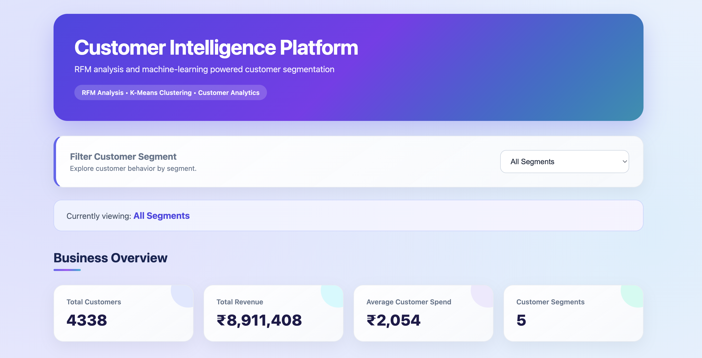
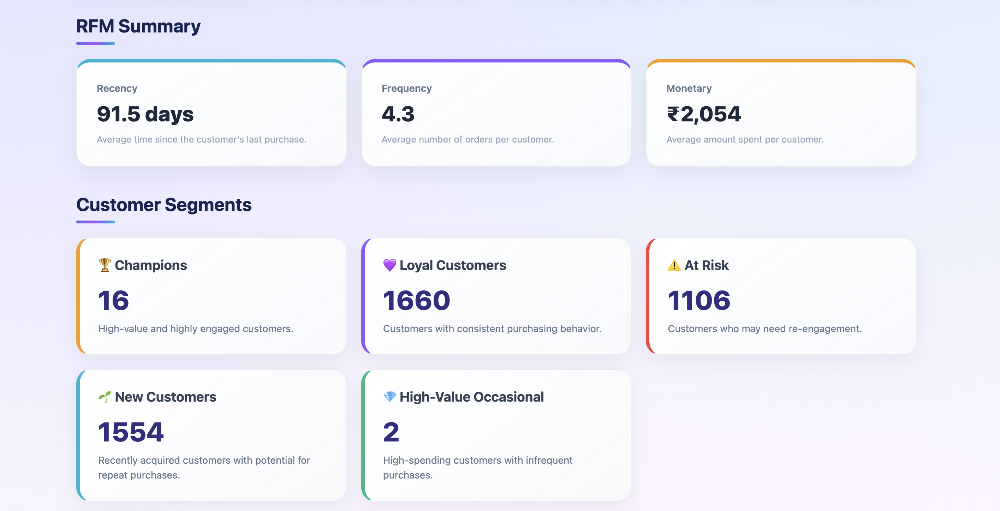
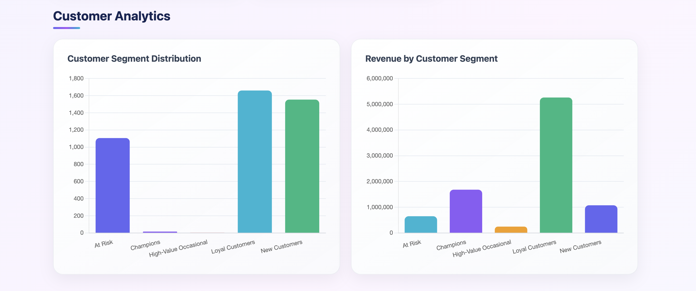
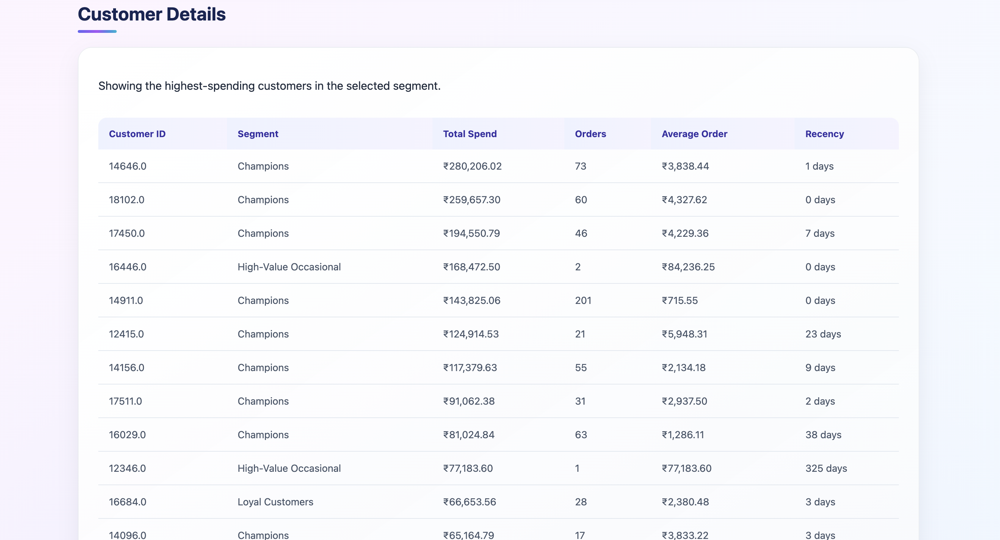

# Customer Intelligence Platform

A customer analytics platform that uses RFM analysis and K-Means clustering to segment customers based on purchasing behavior and generate business insights.

## Features
- Data cleaning and preprocessing
- RFM (Recency, Frequency, Monetary) analysis
- Customer-level feature engineering
- K-Means customer segmentation
- Segment and revenue analysis
- Interactive Flask dashboard
- Customer behavior visualization

## Tech Stack
Python, Pandas, NumPy, Scikit-learn, Matplotlib, Seaborn, Flask, HTML, CSS, JavaScript, Jupyter Notebook, Git & GitHub

## Project Structure
Customer_Intelligence_Platform/
- app/app.py
- app/templates/index.html
- data/Online Retail.xlsx
- data/customer_features.csv
- data/customer_segments.csv
- models/customer_segmentation.py
- notebooks/01_data_exploration.ipynb
- requirements.txt
- README.md

## Dataset
The project uses an Online Retail transaction dataset containing customer purchase information such as Customer ID, Invoice, Invoice Date, Quantity, Unit Price, Product information, and Country. The transaction data is transformed into customer-level analytical data.

## RFM Analysis
RFM analysis evaluates customers using three metrics:

- Recency: How recently a customer made a purchase.
- Frequency: How often a customer makes purchases.
- Monetary: How much a customer has spent.

These metrics are combined to create a customer-level profile.

## Customer Segmentation
The RFM features are scaled and used with the K-Means clustering algorithm to group customers with similar purchasing behavior.

Workflow:

Raw Data → Data Cleaning → Customer Features → RFM Analysis → Feature Scaling → K-Means → Customer Segments → Dashboard → Business Insights

## Dashboard
The Flask dashboard displays customer analytics including customer statistics, segment distribution, revenue by segment, RFM information, and visualizations.

## Business Insights
The segmentation can help identify high-value customers, frequent customers, recent customers, low-engagement customers, and customers who may require retention strategies. These insights can support targeted marketing and customer relationship management.

## Installation

Clone the repository:

git clone https://github.com/sujat1234/Customer_Intelligence_Platform.git

Open the project:

cd Customer_Intelligence_Platform

Create a virtual environment:

python3 -m venv venv

Activate it on macOS/Linux:

source venv/bin/activate

Install dependencies:

pip install -r requirements.txt

## Run the Application

Go to the app directory:

cd app

Run:

python app.py

Open the local Flask URL shown in the terminal in your browser.

## Run the Notebook

From the project root:

jupyter notebook

Open:

notebooks/01_data_exploration.ipynb
## Project Screenshots

### Dashboard

### Customer Segmentation

### Analytics

### Customer Search

### Top Customers

## Machine Learning Workflow

1. Load the retail dataset.
2. Clean and preprocess transaction data.
3. Create customer-level features.
4. Calculate Recency, Frequency, and Monetary values.
5. Scale the RFM features.
6. Apply K-Means clustering.
7. Assign customers to segments.
8. Analyze and visualize the resulting segments.

## Future Improvements
- Customer churn prediction
- Customer lifetime value prediction
- Interactive dashboard filters
- Cloud deployment
- Real-time analytics
- Personalized customer recommendations

## Author

Sujata Kradiya

GitHub: https://github.com/sujat1234